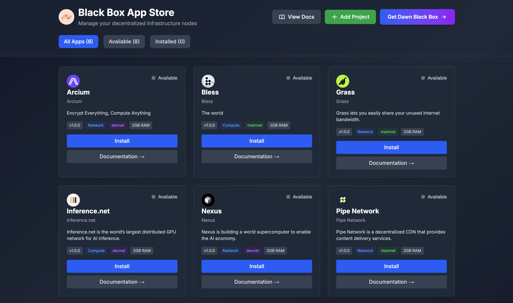

# Dawn Black Box Store 🚀

A modern CLI tool for managing DePIN (Decentralized Physical Infrastructure Network) nodes. Install and manage your infrastructure nodes through a beautiful local web interface, powered by Docker.



## ✨ Features

- 🖥️ **Simple CLI**: One command to launch the web interface
- 🚀 **Easy Installation**: Automated setup with dependency management
- 📦 **Pre-configured Apps**: Popular DePIN projects ready to install
- 🐳 **Docker Powered**: Automatic container management
- 🎨 **Modern UI**: Beautiful, responsive web interface
- 📊 **Real-time Monitoring**: Track running/stopped apps with status indicators
- 📝 **Container Logs**: View logs directly from the interface
- 🔄 **Full Lifecycle Management**: Install, start, stop, and uninstall with one click

## 📋 Prerequisites

**Good news!** The installer will automatically install missing dependencies for you.

The Black Box Store requires:
- **Node.js 18+** - Auto-installed if missing
- **Docker** - Auto-installed if missing
- **Git** - Auto-installed if missing

### Supported Operating Systems
- **macOS** 10.15+ (Catalina and later)
- **Linux** - Ubuntu 20.04+ (and derivatives)

The install script will detect your OS and install the appropriate versions automatically.

## 🚀 Installation

### Quick Install (Recommended)

**macOS:**
```bash
# Download and run (no sudo needed)
curl -fsSL https://raw.githubusercontent.com/meta-light/black-box-store/main/install.sh | bash
```

**Linux (Ubuntu):**
```bash
# Download and run with sudo (needed to install system packages)
curl -fsSL https://raw.githubusercontent.com/meta-light/black-box-store/main/install.sh | sudo bash
```

Or clone and install manually:

**macOS:**
```bash
git clone https://github.com/meta-light/black-box-store.git
cd black-box-store
bash install.sh
```

**Linux:**
```bash
git clone https://github.com/meta-light/black-box-store.git
cd black-box-store
sudo bash install.sh
```

2. **Reload your shell:**

```bash
# macOS (zsh)
source ~/.zshrc

# Linux or macOS (bash)
source ~/.bashrc
```

3. **Launch the Black Box Store:**

```bash
dbb-store
```

The installer will:
- ✅ Automatically install Node.js, Git, and Docker if missing
- ✅ Clone the repository to `~/.black-box-store`
- ✅ Install all dependencies
- ✅ Build the application
- ✅ Install the `dbb-store` CLI command

## 💻 Usage

### Starting the Black Box Store

Simply run:

```bash
dbb-store
```

This will:
1. Start the Next.js server on `http://localhost:3456`
2. Automatically open your browser
3. Display the Black Box Store interface

Press `Ctrl+C` to stop the server.

### Managing Apps

Once the interface is open, you can:

- **Browse Apps**: View all available DePIN applications
- **Install**: Click "Install" on any app to deploy it with Docker
- **Start/Stop**: Control running applications
- **View Logs**: Monitor container logs in real-time
- **Uninstall**: Remove apps and their containers
- **Read Docs**: Access documentation for each app

### Filter Apps

Use the filter buttons to view:
- **All Apps**: Every available application
- **Available**: Apps ready to install
- **Installed**: Apps currently installed (running or stopped)

## 📱 Supported DePIN Projects

The Black Box Store includes:

- **🌐 Pipe Network**: Decentralized CDN network
- **📡 Nexus**: Decentralized compute network
- **🔒 Arcium**: Confidential computing network
- **⚡ Grass**: Bandwidth sharing network
- **🧠 Inference Labs**: AI inference network
- **🚀 TapeDrive**: Decentralized storage network
- **🌟 Tashi**: High-performance DePIN network
- **✨ Bless**: Decentralized infrastructure network

## 🛠️ Development

### Running in Development Mode

```bash
cd ~/.black-box-store
npm run dev
```

The app will be available at `http://localhost:3000`

### Project Structure

```
black-box-store/
├── app/
│   ├── api/                  # API routes for app management
│   │   ├── apps/            # App endpoints
│   │   └── docker/          # Docker health checks
│   ├── page.tsx             # Main UI
│   ├── layout.tsx           # Layout wrapper
│   └── types.ts             # TypeScript types
├── apps/                     # DePIN app definitions
│   ├── interface.ts         # App info interface
│   ├── pipe-network/        # Example app
│   ├── nexus/              # Example app
│   └── [other-apps]/       # More apps
├── lib/
│   ├── docker.ts           # Docker Compose integration
│   └── storage.ts          # Data persistence
├── data/                    # Runtime data (auto-created)
│   ├── installations.json  # Installation records
│   └── compose-files/      # Generated compose files
├── docs/                    # Documentation
│   ├── ADDING_APPS.md      # Guide for adding apps
│   └── [other-docs]/       # More documentation
├── bin/
│   └── dbb-store           # CLI executable
└── install.sh              # Installation script
```

## 📖 Adding New Apps

Want to add a new DePIN project? See our [Adding Apps Guide](https://github.com/meta-light/black-box-store/blob/main/docs/ADDING_APPS.md).

Quick overview:

1. Create a new folder in `apps/[your-app-name]/`
2. Add `info.ts` with app metadata
3. Add `docker-compose.yaml` with Docker configuration
4. Optionally add `docs.md` and `install.sh`
5. Submit a pull request

## 🔧 Configuration

### Custom Port

To run on a different port, edit `~/.black-box-store/bin/dbb-store` and change the `PORT` variable.

### Installation Directory

The application is installed in `~/.black-box-store` by default. All app data and configurations are stored there.

## 🐛 Troubleshooting

### CLI command not found

```bash
# Make sure the path is in your shell config
echo 'export PATH="$HOME/.black-box-store/bin:$PATH"' >> ~/.zshrc
source ~/.zshrc
```

### Docker permission denied

```bash
# Add your user to the docker group (Linux)
sudo usermod -aG docker $USER
# Log out and back in
```

### Port already in use

If port 3456 is already in use, edit the `dbb-store` script and change the `PORT` variable.

### Docker not running

Make sure Docker Desktop (macOS) or Docker daemon (Linux) is running:

```bash
# Check Docker status
docker info

# macOS: Open Docker Desktop
# Linux: Start Docker
sudo systemctl start docker
```

### Update the Black Box Store

```bash
cd ~/.black-box-store
git pull
npm install
npm run build
```

## 🗑️ Uninstallation

To remove the Black Box Store:

```bash
# Remove installation directory
rm -rf ~/.black-box-store

# Remove from PATH (edit your shell config)
# Remove the line containing "black-box-store/bin" from:
# - macOS: ~/.zshrc or ~/.bash_profile
# - Linux: ~/.bashrc
```

## 🔒 Security Notes

⚠️ **Important**: This application:

- Runs locally on your machine (not accessible from the internet)
- Requires Docker socket access (high privilege)
- Executes Docker Compose files with full Docker permissions
- Is intended for personal use in trusted environments

For production or shared environments, consider adding:
- Authentication layer
- Rate limiting
- Network isolation
- Resource limits

## 🛒 Get the Dawn Black Box

Want to run these DePIN apps on dedicated hardware? Check out the **Dawn Black Box** - a powerful device designed specifically for running multiple DePIN nodes:

- 🚀 WiFi 6E Router
- 🧠 64GB RAM
- 💾 480GB NVMe + 1TB SSD
- ⚡ Intel Core i5 14400 (10 cores)
- 🎮 GPU options: 6GB to 20GB VRAM
- 📡 10Gbps networking

[Shop Dawn Black Box →](https://shop.dawninternet.com/)

## 📄 License

MIT

## 🤝 Contributing

Contributions are welcome! Please check out our [Contributing Guide](https://github.com/meta-light/black-box-store/blob/main/docs/CONTRIBUTING.md).

## 💬 Support

- 📚 [View Documentation](https://github.com/meta-light/black-box-store/tree/main/docs)
- 🐛 [Report Issues](https://github.com/meta-light/black-box-store/issues)
- 💡 [Request Features](https://github.com/meta-light/black-box-store/issues/new)

---

Built with ❤️ for the DePIN community
